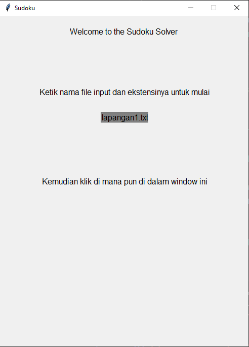
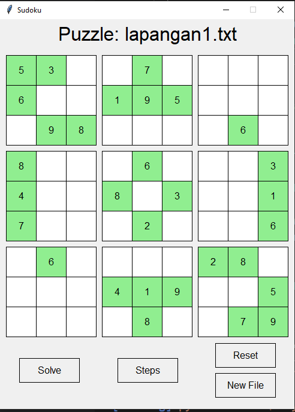
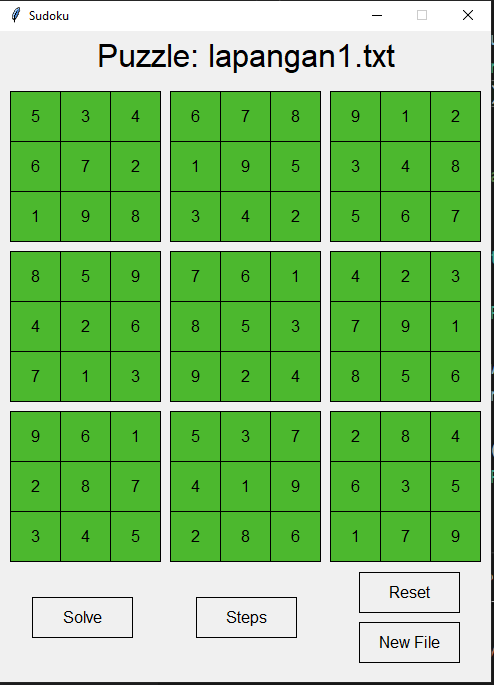
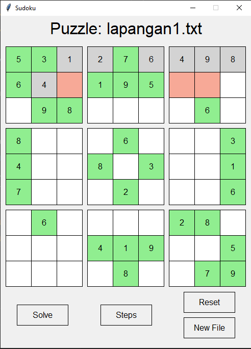

# Kelompok 2 KB F
### Anggota Kelompok :
1. Bayu Eka Prawira (05111940000042)
2. Evelyn Sierra (05111940000111)

# Sudoku Solver Using Backtracking
## Penjelasan Algoritma
Algoritma yang digunakan dalam topik sudoku kali ini adalah algoritma Backtracking. Seperti halnya permasalahan Backtracking lainnya, sudoku dapat diselesaikan dengan mengisikan angka pada cell yang kosong secara satu persatu. Sebelum mengisi cell tersebut, kita harus mengecek dahulu apakah ada angka yang sama pada baris dan kolom serta subgrid 3x3 di mana cell tersebut berada. 

Setelah mengecek semua arah tersebut, kita mengisikan cell tersebut, lalu mengecek secara rekursif apakah angka tersebut sudah mengarah ke solusi atau tidak. Jika tidak, maka dicoba angka selanjutnya untuk mengisi cell tersebut (1 - 9). Namun jika tidak ada solusi, maka akan mengembalikan nilai false.

### File : solvingSudoku.py
```py
def solve(puzzle):
    """
    Solve puzzle dan return bool
  """
    firstEmpty = findNextEmpty(puzzle)
    if not firstEmpty:  # Jika tidak ada yang kosong
        return True
    row, col = firstEmpty
    for val in range(1, 10):
        if canPlace(puzzle, row, col, val):
            puzzle[row][col] = val

            if solve(puzzle):
                return True

            puzzle[row][col] = 0

    return False
```
Di dalam fungsi solve tersebut, kita mengecek dahulu apakah kotak di lokasi yang sejajar baris dan kolom, dan di dalam subgrid 3x3 sudah terisi dengan angka atau belum, jika tidak kosong maka akan mengembalikan True. Untuk mengeceknya, kita menggunakan fungsi findNextEmpty.
```py
def findNextEmpty(puzzle):
    """
    Cari kotak yang kosong selanjutnya
  """
    for row in range(9):
        for col in range(9):
            if puzzle[row][col] == 0:
                return (row, col)
    return None
```
Kemudian, setelah mencari apakah kotak sudah bisa diletakkan angka, dilakukan perulangan. 
```py
def canPlace(puzzle, y: int, x: int, value: int):
    """
        y (int): baris
        x (int): kolom
        value (int): angka yang akan dimasukkan
    """
    # Jika puzzle tidak kosong, return false
    if puzzle[y][x] != 0:
        return False
    
    # cek baris
    row = puzzle[y]
    
    # print(baris)
    if value in puzzle[y]:
        return False
    
    # cek kolom
    col = [line[x] for line in puzzle]
    
    # print(kolom)
    if value in col:
        return False
    
    boxY = y // 3
    
    #print(box Y)
    boxX = x // 3
    
    #print(box X)
    for i in range(boxY * 3, boxY * 3 + 3):
        
        # print
        if value in puzzle[i][boxX * 3:boxX * 3 + 3]:
            return False
    return True
```
Kemudian jika memenuhi keadaan bisa mengisi kotak tersebut, maka diisilah dengan angka dari 1 - 9 dicoba satu-satu. Jika sudah benar terisi, maka akan mereturn True namun jika masih belum, maka kotak akan dikosongkan kembali dan mencoba dengan angka yang lain (Backtrack). Jika tidak mungkin ada hasil, maka akan mengembalikan False.

## Menggabungkan dengan GUI
### File 1 : graphics.py
### File 2 : solvingSudokuWithGraphics.py
Kemudian kita akan mengombinasikan kerja algoritma tersebut dengan GUI yang telah dibentuk sebelumnya. 
```py
def solveWithGraphics(puzzle):

  """
  Menggunakan algoritma backtracking untuk menyelesaikan puzzle
  """
  time.sleep(0.25)
  firstEmpty = findNextEmpty(puzzle) # mencari kotak kosong pada segala arah
  if not firstEmpty: # jika tidak ada kotak yang kosong
    return True
  row, col = firstEmpty
  for val in range(1, 10):
    if canPlace(puzzle, row, col, val):
      puzzle[row][col] = val
      drawBlock(row, col, val, "light gray")

      if solveWithGraphics(puzzle): # untuk pengecekan apakah berhasil
        return True

      puzzle[row][col] = 0 # Jika tidak reset, coba lagi
      drawBlock(row, col, 0, color_rgb(247, 169, 151))  #Block jadi merah apabil agagal
      time.sleep(0.25) # Delay
  return False
```
Untuk cara kerjanya sama dengan proses pada fungsi solve pada file *solvingSudoku.py*, namun ketika program memasukkan angka, pada GUI-nya digambarkan kotak yang sudah terisi angka hasil proses ini dengan warna abu-abu. Kemudian untuk backtrack diberi warna merah dan angkanya direset.

## GUI Gameplay

```py
def main():
  while(True):
    # bersihkan layar setiap kali reset
    clear(win)
    ##### Screen Input nama file #######
    name = Text(Point(win.getWidth()/2, 40), "Welcome to the Sudoku Solver \n")
    instructions = Text(Point(win.getWidth()/2, win.getHeight()/2), "Kemudian klik di mana pun di dalam window ini")
    entry1 = Entry(Point(win.getWidth()/2, 200),10)
    filenamePrompt = Text(Point(win.getWidth()/2, 150),'Ketik nama file input dan ekstensinya untuk mulai') #label untuk entry
    beginning = [name, instructions, entry1, filenamePrompt]
    for item in beginning:
      item.draw(win)
    win.getMouse()  # saat user telah selesai mmenuliskan tulisan
    filename = entry1.getText()
    clear(win)
    ...
```
Pada awal kita masuk, kita diminta untuk membuat sebuah file .txt yang berisi angka-angka sudoku, lalu menyimpannya ke dalam folder /puzzles dan menginputkan nama file dan ekstensinya ke dalam program, lalu meng-klik di segala lokasi di dalam GUI tersebut.
```txt
lapangan1.txt

5 3 0 0 7 0 0 0 0
6 0 0 1 9 5 0 0 0
0 9 8 0 0 0 0 6 0
8 0 0 0 6 0 0 0 3
4 0 0 8 0 3 0 0 1
7 0 0 0 2 0 0 0 6
0 6 0 0 0 0 2 8 0
0 0 0 4 1 9 0 0 5
0 0 0 0 8 0 0 7 9
```
Kemudian program akan mengambil file .txt tersebur dan akan muncul sebuah GUI yang menampilkan hasil inputan sebelumnya dengan program sebagai berikut.
```py
def DrawPuzzle(puzzle: list, color):
  """
  Untuk menampilkan puzzle
  """
  for row in range(9):
    for col in range(9):
      if puzzle[row][col] == 0:
        drawBlock(row, col, puzzle[row][col], 'white')
      else:
        drawBlock(row, col, puzzle[row][col], color)

def main():
  while(True):
    ...
    ##### Ambil puzzle dari file ######
    shouldReset = False
    blankPuzzle = getPuzzleFromFile("puzzles/" + filename)
    puzzle = getPuzzleFromFile("puzzles/" + filename)

    ##### Screen awal #######
    DrawPuzzle(blankPuzzle, "light green")
    header = Text(Point(win.getWidth() / 2, 25), "Puzzle: " + filename)
    header.setSize(24)
    header.draw(win)

    ##### Tombol di bawah screen #####
    buttonWidth = 100
    buttonHeight = 40
    solveButton = Rectangle(Point((win.getWidth() / 6) - (buttonWidth / 2), win.getHeight() - 65 - buttonHeight / 2),
                          Point(win.getWidth()/6+ buttonWidth / 2, win.getHeight() - 65 + buttonHeight / 2))
    solveText = Text(Point((win.getWidth() / 6), win.getHeight() - 65), "Solve")

    solveButton.draw(win)
    solveText.draw(win)

    steps = Rectangle(Point((win.getWidth() / 2) - (buttonWidth / 2), win.getHeight() - 65 - buttonHeight / 2), Point(win.getWidth() / 2 + (buttonWidth / 2), win.getHeight() - 65 + buttonHeight / 2))
    solveText = Text(Point((win.getWidth() / 2), win.getHeight() - 65), "Steps")

    steps.draw(win)
    solveText.draw(win)

    reset = Rectangle(Point((5 * win.getWidth() / 6) - (buttonWidth / 2), win.getHeight() - 90 - buttonHeight / 2),
                          Point(5 * win.getWidth()/ 6 + buttonWidth / 2, win.getHeight() - 90 + buttonHeight / 2))
    resetText = Text(Point((5 * win.getWidth() / 6), win.getHeight() - 90), "Reset")
    reset.draw(win)
    resetText.draw(win)

    newFile = Rectangle(Point((5 * win.getWidth() / 6) - (buttonWidth / 2), win.getHeight() - 40 - buttonHeight / 2),
                          Point(5 * win.getWidth()/ 6 + buttonWidth / 2, win.getHeight() - 40 + buttonHeight / 2))
    newFileText = Text(Point((5 * win.getWidth() / 6), win.getHeight() - 40), "New File")
    newFile.draw(win)
    newFileText.draw(win)
    ...
```
Kemudian jika kita menekan tombol solve, maka solusi akan langsung muncul secara instan. Tetapi jika kita menekan tombol step, maka akan muncul solusi secara bertahap yang menampilkan bagaimana algoritma ini berjalan. Untuk tombol reset, program akan me-reset field dengan kondisi awal. Untuk tombol new file, kita menambahkan file .txt yang baru.

## Snapshots 


Landing Page



Awal



Setelah diklik tombol solve



Setelah berjalan dengan step (merah = Backtrack)